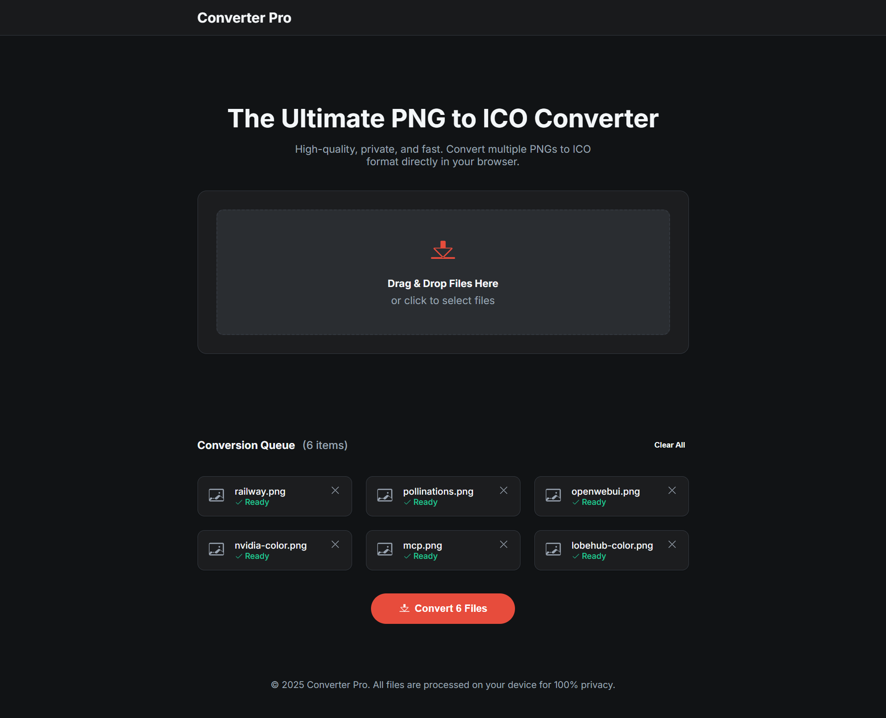

# Converter Pro: A Modern PNG to ICO Web Application

Converter Pro is a fully-featured, client-side web application for converting PNG images to the ICO format. Built with vanilla HTML, CSS, and JavaScript, it requires no server-side processing, ensuring 100% user privacy. The application features a modern, responsive user interface that automatically adapts to the user's system theme (light or dark mode).

This project was developed iteratively, starting from a basic converter and evolving to include batch processing, high-quality image resizing, a refined user experience with animations, and an intuitive, responsive design.

## ✨ Features

*   ✅ **Batch Conversion:** Convert multiple PNG files to ICO format in a single operation.
*   🔒 **100% Client-Side:** All processing is done in your browser. Files are never uploaded to a server, guaranteeing privacy.
*   🖐️ **Drag & Drop Interface:** A beautiful and intuitive drag-and-drop zone for easy file selection.
*   🎨 **High-Quality Resizing:** Implements a step-down resizing algorithm to ensure crisp, clear icons even at small sizes (16x16, 32x32).
*   🌗 **Automatic System Theme:** The UI seamlessly switches between light and dark mode based on your operating system's settings.
*   📱 **Fully Responsive:** A polished and usable experience on all devices, from mobile phones to widescreen desktops.
*   🗂️ **ZIP Archive Download:** All converted ICO files are automatically packaged into a single `.zip` file for convenient downloading.
*   🚀 **Modern UX/UI:** Built with modern design principles, including smooth animations, micro-interactions, and smart UI feedback like auto-scrolling and item counts.

## 🚀 How to Use

This is a standalone web application. No installation is required.

1.  Download the `index.html` file from this repository.
2.  Open the `index.html` file in any modern web browser (Chrome, Firefox, Edge, Safari).
3.  That's it! Drag your PNG files onto the drop zone or click to select them.

## 🛠️ Technology Stack

This project is intentionally built without any frameworks to demonstrate the power of modern browser APIs.

*   **HTML5:** For the semantic structure of the application.
*   **CSS3:** For all styling, including:
    *   **Flexbox & Grid:** For robust and responsive layouts.
    *   **CSS Variables:** To manage themes and colors efficiently.
    *   **Media Queries:** For adapting the UI to different screen sizes and the user's system theme (`prefers-color-scheme`).
    *   **Animations & Transitions:** To create a smooth, modern user experience.
*   **JavaScript (ES6+):** For all application logic, utilizing:
    *   **File API:** To handle local file access (reading, selecting).
    *   **Canvas API:** For high-quality image resizing and manipulation.
    *   **Blob:** To construct the ICO file in memory from binary data.
*   **[JSZip](https://stuk.github.io/jszip/):** A third-party library used to create the final `.zip` archive on the client side.

## ⚙️ How It Works

The conversion process is handled entirely in the user's browser in a few key steps:

1.  **File Selection:** The user selects one or more PNG files using the file input or the drag-and-drop interface. The `File API` reads these files into memory.
2.  **High-Quality Resizing:** For each selected image, a step-down resizing algorithm is executed. The source image is repeatedly drawn onto smaller canvases (halving its size each time) until it is close to the target icon size. This preserves much more detail than a single, direct resize.
3.  **ICO File Construction:** The application programmatically constructs a valid `.ico` file in memory. This involves:
    *   Writing the ICO file header.
    *   Creating an icon directory entry for each standard size (256x256, 128x128, 64x64, 48x48, 32x32, 16x16).
    *   Converting the resized canvas for each size into a PNG `Blob`.
    *   Appending the binary data of each PNG `Blob` to the file.
4.  **ZIP Archiving:** Once all `.ico` files have been generated as `Blob`s in memory, the **JSZip** library is used to package them into a single `.zip` archive, which is then triggered for download.

## 📄 License

This project is open-source and available under the **MIT License**. See the [LICENSE](LICENSE) file for more info.

---

_Feel free to fork this repository, make it your own, or contribute to its development!_
